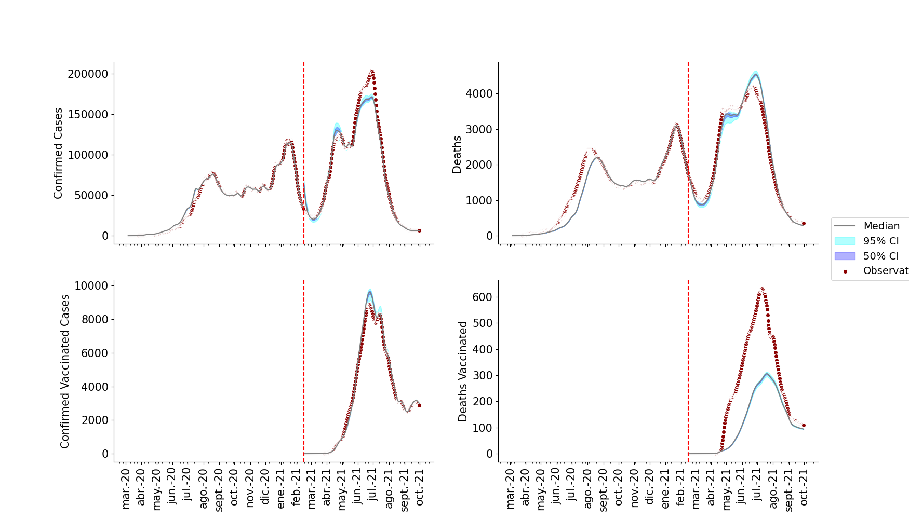

## Introdution

SARS-CoV-2 has been the cause associated with high morbidity and mortality during the last two years (@cummingsEpidemiologyClinicalCourse2020, @wuCharacteristicsImportantLessons2020). This pathogen is respiratory through infection caused by small liquid particles from close contact between infectious and susceptible individuals (@Coronavirus, @liEarlyTransmissionDynamics2020). In the pre-vaccination scenario, the different countries' governments implemented non-pharmaceutical interventions (NPIs) such as facemasks, social distancing, and localized quarantines, among others, to control viral transmission (@premEffectControlStrategies2020). However, each of these NPIs varied in effectiveness across countries and regions, especially in lower-middle-income countries (LMICs), where the health system response to the COVID-19 pandemic is more limited (@carterCovid19Year2021). In this work, we aim to clarify aspects of transmission dynamics and epidemiological burden in this LMIC setting, specifically in Colombia.

Through the pandemic, mathematical models were used to understand and alert the public and governments, principally about the spread and mortality of SARS-CoV2 and have been used to characterize the mechanism behind the epidemiological dynamics of the virus in different scenarios and places from the measurements of cases and deaths (@bayerSemiparametricModelingSARSCoV22021). However, incorporating this information into inference led to a problem with the measurement noise and a lack of data for specific populations. Therefore, we use a SEIRD stochastic model, and an inference algorithm is used to predict the transmission's dynamics informed only by incident cases and deaths. We looked to study the dynamics of the disease in the whole population to observe the impact of the disease on the Colombia population.

We used a method to estimate a variable time contact rate between people, which allows the model to capture the NPIs and changes in human behavior. We also included a time-varying reporting rate that enables the model to capture the changes in the infection testing policies in the country (@bayerSemiparametricModelingSARSCoV22021). Finally, we use an Ensemble Adjustment Kalman Filter (EAKF) for data assimilation and inference of the parameters that better adjust the model to the cases and deaths observed (@andersonEnsembleAdjustmentKalman2001).

## Methods
### Data
We took the time series of daily reports by age of a cohort of 40 million people in Colombia of positive cases of COVID-19 and deaths, presented in the work of Arregoces-Castillo (@arregoces-castilloEffectivenessCOVID19Vaccines2022) which corresponded to the days between March 6, 2020 and February 14, 2021. Due to noisy data, we took the sum of the previous 7 days for each day of the time series and a Gaussian moving window that smoothed and averaged the different outliers.

### Model
The model divides the population into 14 compartments: S = susceptible individuals; E = exposed but not yet infectious individuals; Iu = infected unreported individuals who don’t carry out a test for COVID; Ir = infected reported individuals who carry out a test; Id = critical infected individuals who are eventually going to die; D = death individuals by COVID; R = recovery individuals and their respective compartments for the vaccinated individuals represented by a V; the dynamics between compartments are described in Figure 1, where α represents the report rate of the positive cases, ifr and ivfr the infection fatality rate for unvaccinated and vaccinated individuals respectively, κ the incubation period, γ the recovery period, γd the period in which a person goes from critical condition to death, Vr the vaccination rate, δ the loss immunity rate and λ the force of infection which is represented by the equation 1.
$$
\lambda = \frac{I_r+ I_u+1-VEI(IV_r+IV_u)}{N}  (1)
$$
Where β represents the contact rate between the infectious and susceptible individuals, VEI the effectiveness of the vaccine against the infection, σ the relative transmission by the unreported individuals, and N the total population. Mathematically, the model is defined by the equations.

|                Transitions                |                                       |
|:-----------------------------------------:|:-------------------------------------:|
|         ΔS>E = Binom(St, 1-e-λΔt)        |       ΔR>S=Binom(Rt, 1-e -δΔt)       |
| ΔS>SV=Binom(Vrt, 1-e -(St/(St+Et+Rt))Δt) |     ΔSV>EV = Binom(SVt, 1-e-λΔt)     |
| ΔE>EV=Binom(Vrt, 1-e -(Et/(St+Et+Rt))Δt) |   ΔEV>IVu=Binom(EVt, 1-e -(1-α)ΚΔt)  |
|      ΔE>Iu=Binom(Et, 1-e -(1-α)ΚΔt)      | ΔEV>IVr=Binom(EVt, 1-e -α(1-ifr)ΚΔt) |
|     ΔE>Ir=Binom(Et, 1-e -α(1-ifr)ΚΔt)    |  ΔEV>IVd=Binom(EVt, 1-e -α(ifr)ΚΔt)  |
|      ΔE>Id=Binom(Et, 1-e -α(ifr)ΚΔt)     |     ΔIVu>RV=Binom(IVut, 1-e -γΔt)    |
|        ΔIu>R=Binom(Iut, 1-e -γΔt)        |     ΔIVr>RV=Binom(IVrt, 1-e -γΔt)    |
|        ΔIr>R=Binom(Irt, 1-e -γΔt)        |    ΔIVd>DV=Binom(IVut, 1-e -γdΔt)    |
|        ΔId>D=Binom(Iut, 1-e -γdΔt)       |      ΔRV>SV=Binom(RVt, 1-e -δΔt)     |
| ΔR>RV=Binom(Vrt, 1-e -(Rt/(St+Et+Rt))Δt) |                                       |

|               Model              |                                            |
|:--------------------------------:|:------------------------------------------:|
| S(t+Δt)=S(t)-ΔS>E-ΔS>SV+ΔR>S            | SV(t+Δt)=SV(t)-ΔSV>EV+ΔS>SV+ΔRV>SV                |
| E(t+Δt)=E(t)+ΔS>E-ΔE>EV-ΔE>Iu-ΔE>Ir-ΔE>Id | EV(t+Δt)=EV(t)+ΔSV>EV+ΔE>EV-ΔEV>IVu-ΔEV>IVr-ΔEV>IVd |
| Iu(t+Δt)=Iu(t)-ΔIu>R+ΔE>Iu             | IVu(t+Δt)=IVu(t)-ΔIVu>RV+ΔEV>IVu                 |
| Ir(t+Δt)=Ir(t)-ΔIr>R+ΔE>Ir             | IVr(t+Δt)=IVr(t)-ΔIVr>RV+ΔEV>IVr                 |
| Id(t+Δt)=Id(t)-ΔId>D+ΔE>Id             | IVd(t+Δt)=IVd(t)-ΔIVd>DV+ΔEV>IVd                 |
| R(t+Δt)=R(t)-ΔR>S+ΔIu>R+ΔIr>R-ΔR>RV      | RV(t+Δt)=RV(t)-ΔRV>SV+ΔIVu>RV+ΔIVr>RV+ΔR>RV        |
| C(t)=ΔEIr+ΔEId                     | CV(t)=ΔEVIVr+ΔEVIVd                          |
| D(t)=ΔIdD                          | DV(t)=ΔIVdD                                  |

<center>
```{r, fig.cap = "Figure 1. SEIIIRD Model", out.width=800}
knitr::include_graphics("../figs/Model.png")
```
</center>

### Transmission model fitting
For this approach, we fitted the model to the time series of daily reports by age of a cohort of 40 million people in Colombia of positive cases of COVID-19 and deaths presented in Arregoces-Castillo's work (@arregoces-castilloEffectivenessCOVID19Vaccines2022), we inferred the parameters of the rate of contact between infected and susceptible people (β) and the reporting rate of confirmed cases of COVID-19 (ɑ)through the Ensemble Adjustment Kalman Filter (EAKF), and we inferred the other parameters constant over time. The parameter of the number of vaccines was forced to be 0 in the pre-vaccination time period. The EAKF was performed daily in sequence for the cases and deaths, and the gain of the parameters and the state variables was corrected with a range of allowed parameters established from the beginning and finally iterated 450 times.


## Results

By calculating the average of the iterations, it is possible to observe the trend of the model compared to the observations, as shown in figure 2.

<center>
```{r, fig.cap = "Figure 2. Fitting the model to the observations.", out.width=800}

```
</center>

It is also possible to observe how the contact rate and the reporting rate vary over time to achieve a better fit of the model, as can be seen in Figure 3, as well as the final result of each class in the model in Figure 4.

<center>
```{r, fig.cap = "Figure 3. Parameter inference over time.", out.width=800}
knitr::include_graphics("../figs/inference_results.png")
```
</center>

<center>
```{r, fig.cap = "Figure 4. Inference of state variables over time.", out.width=800}
knitr::include_graphics("../figs/state_variables.png")
```
</center>

## Discussion


# References
<div id="refs"></div>
