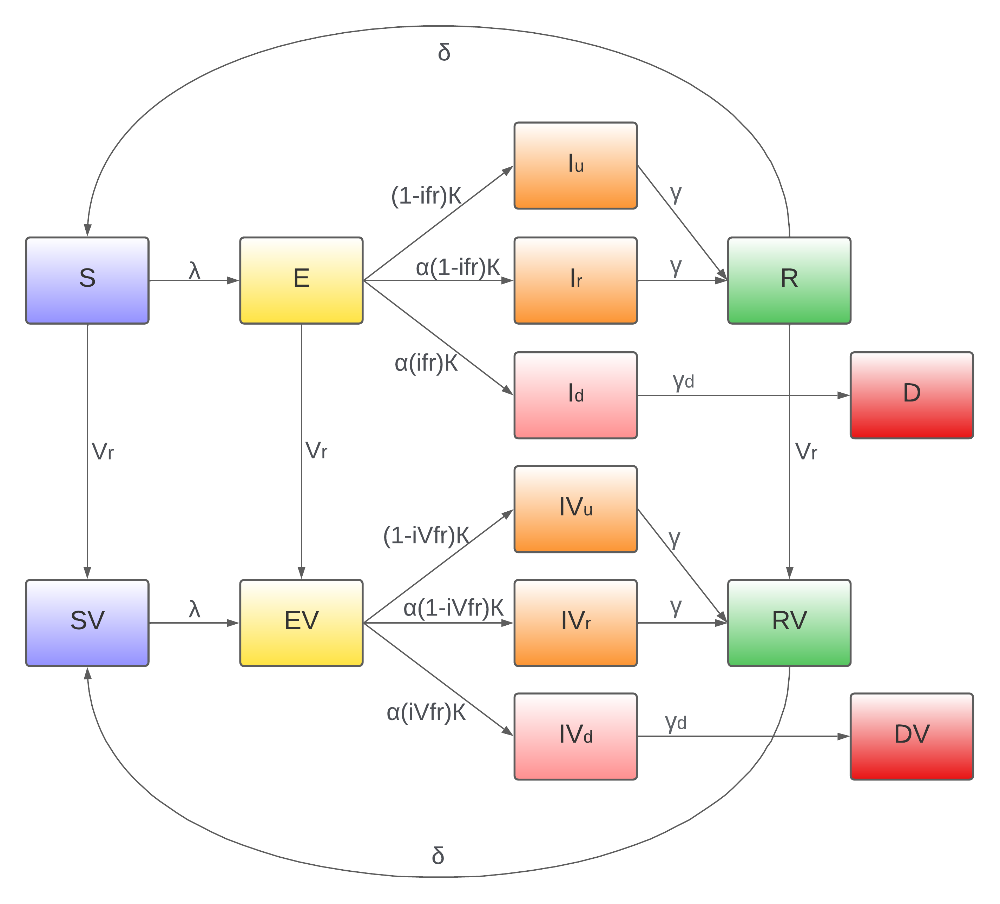
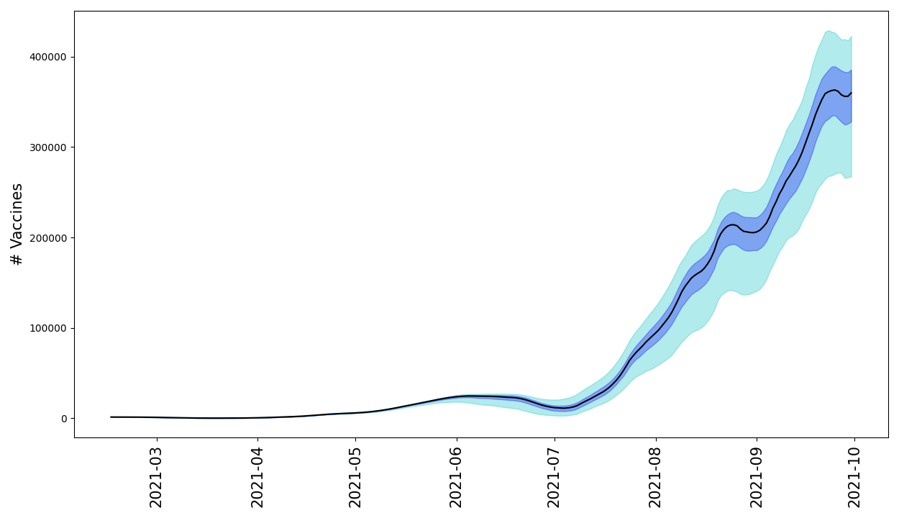
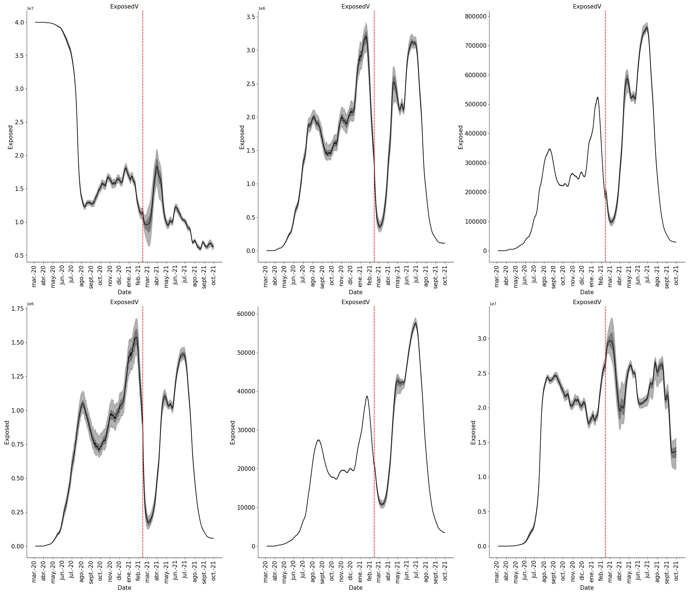

## Introdution

During the last two years, SARS-CoV-2 has been linked to high morbidity and mortality (@cummingsEpidemiologyClinicalCourse2020, @wuCharacteristicsImportantLessons2020) .This pathogen is respiratory through infection caused by small liquid particles from close contact between infectious and susceptible individuals (@Coronavirus, @liEarlyTransmissionDynamics2020). In the pre-vaccination scenario, the different countries’ governments implemented non-pharmaceutical interventions (NPIs) such as facemasks, social distancing, and localized quarantines, among others, to control viral transmission (@premEffectControlStrategies2020). In the vaccination scenario, national vaccination campaigns are implemented following prioritization based on risk and exposure to decrease deaths rapidly and impact transmission. These measures allow for the relaxation of control measures and a reduction in the impact of the COVID-19 pandemic (@gozziAnatomyFirstSix2022, @mcnamaraEstimatingEarlyImpact2022).However, each of these scenarios varied in effectiveness across countries and regions, especially in lower-middle-income countries (LMICs), where the health system's response to the COVID-19 pandemic is more limited (@carterCovid19Year2021). In this work, we aim to clarify aspects of transmission dynamics and epidemiological burden in this LMIC setting, specifically in Colombia, where the measure of the effectiveness of mass vaccination is intertwined with a high proportion of the population with previously acquired immunity by natural infection and the role of enhanced transmissibility and partial immune escape of new variants.

Through the pandemic, mathematical models were used to understand and alert the public and governments, principally about the spread and mortality of SARS-CoV2 and have been used to characterize the mechanism behind the epidemiological dynamics of the virus in different scenarios and places from the measurements of cases, deaths (@bayerSemiparametricModelingSARSCoV22021), and vaccination reports segregated by age and region. However, incorporating this information into inference led to a problem with the measurement noise and a lack of data for specific populations. Therefore, we use a SEIRD stochastic model, and an inference algorithm is used to predict the transmission’s dynamics informed only by incident cases and deaths.

We used a method to estimate a variable time contact rate between people, which allows the model to capture the NPIs and changes in human behavior. We also included a time-varying reporting rate that enables the model to capture the changes in the infection testing policies in the country and the different cities (@bayerSemiparametricModelingSARSCoV22021). Finally, we use an Ensemble Adjustment Kalman Filter (EAKF) for data assimilation and inference of the parameters that better adjust the model to the cases and deaths observed (@andersonEnsembleAdjustmentKalman2001).

Through the inference, we were able to observe that although vaccination controlled the Effective Reproduction Number in Colombia despite the fact that all the NPIs were gradually withdrawn, the loss of immunity induced by the infection reached by the majority of the population before the onset of mass vaccination allowed the highest peak of positive cases and deaths from COVID-19 but also significantly decreased the impact of the disease on people vaccinated with the full vaccination schedule.

## Methods

### Data
We took the time series of daily reports by age of a cohort of 40 million people in Colombia of positive cases of COVID-19 and deaths, presented in the work of Arregoces-Castillo (@arregoces-castilloEffectivenessCOVID19Vaccines2022), which corresponded to the days between March 6, 2020 and October 27, 2021. These cases and deaths are anonymized and segregated by those who have a complete vaccination schedule, those vaccinated with a single dose, or those who are not vaccinated. In our study, we included people in these last categories as people without a complete vaccination scheme. Due to noisy data, we took the sum of the previous 7 days for each day of the time series and a Gaussian moving window that smoothed and averaged the different outliers.

### Model
The model divides the population into 14 compartments: S = susceptible individuals; E = exposed but not yet infectious individuals; Iu = infected unreported individuals who don’t carry out a test for COVID; Ir = infected reported individuals who carry out a test; Id = critical infected individuals who are eventually going to die; D = death individuals by COVID; R = recovery individuals and their respective compartments for the vaccinated individuals represented by a V; the dynamics between compartments are described in Figure 1, where α represents the report rate of the positive cases, ifr and ivfr the infection fatality rate for unvaccinated and vaccinated individuals respectively, κ the incubation period, γ the recovery period, γd the period in which a person goes from critical condition to death, Vr the vaccination rate, δ the loss immunity rate and λ the force of infection, which is represented by the equation 1.
$$
\lambda = \frac{I_r+ I_u+1-VEI(IV_r+IV_u)}{N}  (1)
$$
Where β represents the contact rate between the infectious and susceptible individuals, VEI the effectiveness of the vaccine against the infection, σ the relative transmission by the unreported individuals, and N the total population. Mathematically, the model is defined by the following equations:

|                Transitions                |                                       |
|:-----------------------------------------:|:-------------------------------------:|
|         ΔS>E = Binom(St, 1-e-λΔt)        |       ΔR>S=Binom(Rt, 1-e -δΔt)       |
| ΔS>SV=Binom(Vrt, 1-e -(St/(St+Et+Rt))Δt) |     ΔSV>EV = Binom(SVt, 1-e-λΔt)     |
| ΔE>EV=Binom(Vrt, 1-e -(Et/(St+Et+Rt))Δt) |   ΔEV>IVu=Binom(EVt, 1-e -(1-α)ΚΔt)  |
|      ΔE>Iu=Binom(Et, 1-e -(1-α)ΚΔt)      | ΔEV>IVr=Binom(EVt, 1-e -α(1-ifr)ΚΔt) |
|     ΔE>Ir=Binom(Et, 1-e -α(1-ifr)ΚΔt)    |  ΔEV>IVd=Binom(EVt, 1-e -α(ifr)ΚΔt)  |
|      ΔE>Id=Binom(Et, 1-e -α(ifr)ΚΔt)     |     ΔIVu>RV=Binom(IVut, 1-e -γΔt)    |
|        ΔIu>R=Binom(Iut, 1-e -γΔt)        |     ΔIVr>RV=Binom(IVrt, 1-e -γΔt)    |
|        ΔIr>R=Binom(Irt, 1-e -γΔt)        |    ΔIVd>DV=Binom(IVut, 1-e -γdΔt)    |
|        ΔId>D=Binom(Iut, 1-e -γdΔt)       |      ΔRV>SV=Binom(RVt, 1-e -δΔt)     |
| ΔR>RV=Binom(Vrt, 1-e -(Rt/(St+Et+Rt))Δt) |                                       |

|               Model              |                                            |
|:--------------------------------:|:------------------------------------------:|
| S(t+Δt)=S(t)-ΔS>E-ΔS>SV+ΔR>S            | SV(t+Δt)=SV(t)-ΔSV>EV+ΔS>SV+ΔRV>SV                |
| E(t+Δt)=E(t)+ΔS>E-ΔE>EV-ΔE>Iu-ΔE>Ir-ΔE>Id | EV(t+Δt)=EV(t)+ΔSV>EV+ΔE>EV-ΔEV>IVu-ΔEV>IVr-ΔEV>IVd |
| Iu(t+Δt)=Iu(t)-ΔIu>R+ΔE>Iu             | IVu(t+Δt)=IVu(t)-ΔIVu>RV+ΔEV>IVu                 |
| Ir(t+Δt)=Ir(t)-ΔIr>R+ΔE>Ir             | IVr(t+Δt)=IVr(t)-ΔIVr>RV+ΔEV>IVr                 |
| Id(t+Δt)=Id(t)-ΔId>D+ΔE>Id             | IVd(t+Δt)=IVd(t)-ΔIVd>DV+ΔEV>IVd                 |
| R(t+Δt)=R(t)-ΔR>S+ΔIu>R+ΔIr>R-ΔR>RV      | RV(t+Δt)=RV(t)-ΔRV>SV+ΔIVu>RV+ΔIVr>RV+ΔR>RV        |
| C(t)=ΔEIr+ΔEId                     | CV(t)=ΔEVIVr+ΔEVIVd                          |
| D(t)=ΔIdD                          | DV(t)=ΔIVdD                                  |

### Transmission model fitting
For this approach, we fitted the model to the time series of daily reports by age of a cohort of 40 million people in Colombia of positive cases of COVID-19 and deaths presented in Arregoces-Castillo’s work (@arregoces-castilloEffectivenessCOVID19Vaccines2022), which are segregated into people not vaccinated, with one dose, a complete schedule, and age group. For this study, we assumed that people with one dose are part of the unvaccinated population, and we inferred the parameters of the rate of contact between infected and susceptible people (β), the reporting rate of confirmed cases of COVID-19 (ɑ) and the number of vaccines that were applied each day (Vr) through the Ensemble Adjustment Kalman Filter (EAKF), and we inferred the other parameters constant over time. Since the parameter of the number of vaccines was forced to be 0 in the pre-vaccination time period, starting February 15, 2021, it was allowed to infer The EAKF was performed daily in sequence for the unvaccinated and vaccinated cases and deaths, and the gain of the parameters and the state variables was corrected with a range of allowed parameters established from the beginning and finally iterated 450 times the period of time pre-vaccination and 360 times the post-vaccination time period.

## Results

To validate the model, we took the average of the iterations and compared it with the real data of cases and deaths, as can be seen in Figure 2, where the median and confidence intervals of the simulations are shown.

It is also possible to observe how the contact rate and the reporting rate vary over time to achieve a better fit of the model, as well as the final result of each state variable in the model, as can be seen in the following figures.

## Discussion

As can be seen, the model has a fairly close fit to real-world observations, which allows us to validate the results of parameter inference. Additionally, the variation of the contact rate before the vaccination process is observed, which decreases at the beginning but progressively begins to increase its value, which can be attributed to the containment measures applied at the beginning and its progressive relaxation and exceptions that were left. doing. However, once the mass vaccination process begins, a significant increase in the rate is observed, attributed to the removal of all restrictions and economic reactivation. However, this rise is regulated by the increase in people vaccinated throughout the year.

Additionally, we can observe the efforts of the government for the massive testing and tracking of positive cases at the beginning of the pandemic, but since this massive testing was not enough for the number of cases presented and how over time it was decreasing until the economic reactivation, it was once again mandatory to carry out tests that proved the negative status of COVID-19.

On the other hand, it is possible to observe that after the vaccination process began, the highest peak of positive cases in history was obtained, which is due in part to the fact that many people had already acquired immunity due to infection at the beginning of the pandemic and the loss of immunity before being vaccinated, which increased the number of infections, as well as the removal of contingency measures that reduced contacts between people, which facilitated the growth of the disease once again in the country.

Finally, it is possible to observe the great effect that the use of mathematical models has on the understanding of the dynamics of a disease, as well as the inference of parameters and the possible prediction of behaviors, which can be used as a basis for decision-making. However, since COVID-19 is such a variable disease, it is necessary to continue studying its effects on the country and the effect it may have on different age groups.

# References

